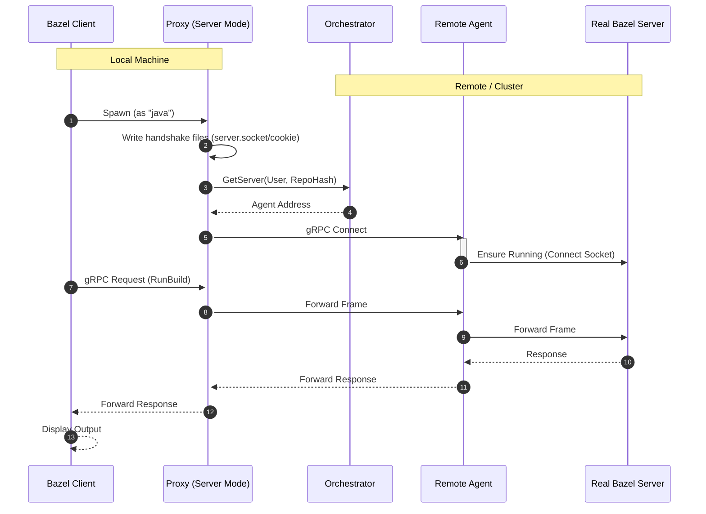

# Remote Build Server Architecture

This document describes the architecture of the Remote Build Server (RBS), a system that allows local Bazel clients to execute builds seamlessly on remote infrastructure.

## Core Concept: Proxy Server Mode

RBS replaces the standard Bazel Server process with a lightweight **gRPC Proxy**. This proxy runs on the developer's machine, effectively "masquerading" as the Bazel Server. It intercepts gRPC calls from the Bazel Client and forwards them to a remote **Agent** running in the build cluster.

This architecture ensures:
1.  **Native Experience**: The developer uses the standard `bazel` CLI (configured via `server_javabase`).
2.  **Remote Execution**: aggregated compute and storage in the cloud.
3.  **IDE Compatibility**: IDEs that speak the Bazel gRPC protocol work out of the box.

## Components

### 1. Bazel Client (Local)
The standard Bazel binary (e.g., via Bazelisk). It is configured to use a custom "Server Javabase", which forces it to execute our Proxy instead of the actual Bazel Server JVM.

### 2. Proxy (Local)
A lightweight Go binary that:
-   **Implements Bazel Lifecycle**: Handles the Bazel Server handshake (writing `server.socket`, `request_cookie` to the output base).
-   **Session Management**: Contacts the **Orchestrator** to resolve or provision a remote build session for the current workspace.
-   **Tunneling**: Forwards the underlying gRPC stream (CommandServer) to the remote Agent.

### 3. Orchestrator (Control Plane)
A central service that:
-   Authenticates users.
-   Manages **ComputeServices** (e.g., Kubernetes, Local Process).
-   Maps `(User, RepoHash)` to active Agent instances.

### 4. Agent (Remote)
A pod or process running in the build environment. It:
-   Mounts the user's source code (via shared storage like Filestore/NFS).
-   Runs the *actual* Bazel Server instance.
-   Receives forwarded gRPC traffic from the Proxy.

## Data Flow

## Storage Strategy

To ensure consistency between the local client (which expects to see `bazel-out`) and the remote server, RBS relies on **Shared Storage** (e.g., Google Cloud Filestore or NFS).
-   The source tree is synchronized or mounted to the Remote Agent.
-   Build artifacts (`bazel-out`) are written to the shared storage.
-   (Optional) The local machine mounts the same storage to view artifacts.
