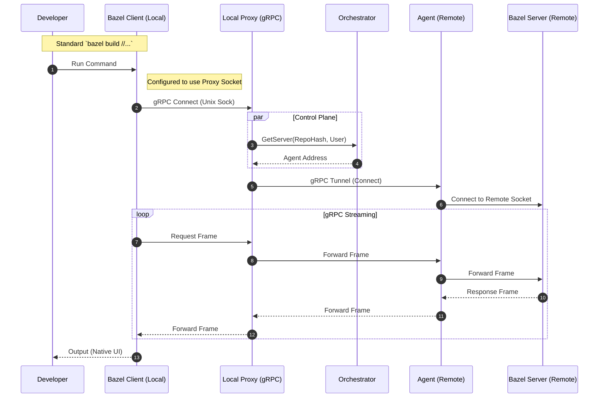

# Architecture Proposal: Generic gRPC Proxy

This document explores an alternative architecture where the "Remote Build Server" behaves as a transparent proxy for the native Bazel client/server gRPC protocol, rather than wrapping `stdin/stdout`.

## Concept

Instead of a custom CLI (`jbazel`) that streams text, we run the **standard Bazel CLI** locally. We interpose a **gRPC Proxy** between the local Bazel Client and the remote Bazel Server (running in the Agent).

The Bazel Client communicates with the Bazel Server using a gRPC protocol over a UNIX domain socket. By intercepting this connection, we can tunnel the build command to a remote environment while preserving the native local CLI experience.

## Architecture Diagram

## detailed Flow

1.  **Configuration**: The local `bazel` command is configured (via `.bazelrc` or alias) to use a custom `--server_javabase` or socket path that points to our **Local Proxy**.
    *   *Challenge*: Bazel's client-server handshake logic is complex and primarily file-system based (output_base lock). We might need a lightweight "Launcher" that sets up the socket interception.
2.  **Local Proxy**:
    *   Listens on a UNIX socket.
    *   On connection: Authenticates and resolves the remote endpoint via the **Orchestrator**.
    *   Establishes a tunnel (gRPC-over-gRPC or TCP stream) to the **Agent**.
3.  **Agent**:
    *   Receives the tunnelled connection.
    *   Ensures the **Bazel Server** is running in the remote workspace (spawning if necessary).
    *   Connects to the Remote Bazel Server's UNIX socket.
4.  **Traffic**:
    *   The gRPC frames (CommandServer methods) are proxied transparently.
    *   Stdin/Stdout/Stderr and Exit Code are handled natively by the Bazel gRPC protocol.

## Storage Strategy: Google Cloud Filestore

To make this architecture viable, we leverage **Google Cloud Filestore** (or a high-performance NFS solution) to ensure a unified view of the filesystem across the local/remote boundary.

*   **Remote Side**: The Agent Pod mounts the Filestore volume as its workspace root.
*   **Local Side**: The Developer Machine mounts the **same** Filestore volume (e.g., via Cloud VPN/Interconnect).

This shared storage layer solves two critical problems:
1.  **Input Sync**: No need for `rsync`. Edits on the local mount are immediately visible to the Remote Agent.
2.  **Bazel Consistency**: The local Bazel Client can access `bazel-out` and other artifacts directly if needed, satisfying its expectation of a shared filesystem for simplified convenience symlinks and jar loading.

## Comparison

| Feature | Current (stdin/stdout wrapper) | Proposed (gRPC Proxy) |
| :--- | :--- | :--- |
| **CLI Experience** | Custom (`jbazel`), might diverge from standard. | Native `bazel`. 100% compatible UI. |
| **IDE Support** | Hard (Plugins expect standard bazel). | **Native**. IDEs just run `bazel`. |
| **Complexity** | Low (Text streaming). | High (Tunneling, Socket interception, gRPC framing). |
| **Performance** | Good (Streaming). | Excellent (Native protocol). |
| **Analysis** | Remote (Fast, shared). | Remote (Fast, shared). |
| **Input Sync** | Manual/Rsync. | **Shared Filestore (Zero copy)**. |

## Feasibility Notes
*   **Bazel Protocol**: The protocol between client and server is not strictly public API, but it is gRPC.
*   **Socket Path**: Bazel computes the socket path based on the output base. We would need to ensure the Local Proxy listens exactly where the Client expects, or use a patched Client/wrapper that directs traffic to us.
*   **Filesystem**: The Bazel Client expects to share a filesystem with the Server. **Filestore** perfectly addresses this requirement, ensuring that any file written by the remote server is instantly accessible to the local client.

## Recommendation
This approach offers the "Holy Grail" of remote builds: **Remote Execution with Local Experience**. It enables IDE integrations to work seamlessly. However, it requires a deeper understanding of the Bazel Client-Server internal protocol.
