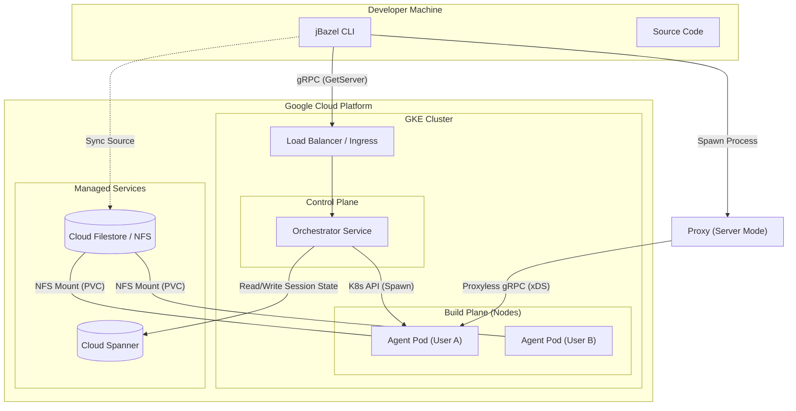

# Production Architecture (Intended State)

This document outlines the final intended architecture for the Remote Build Server (RBS) running in a production Kubernetes (GKE) environment, integrating Google Cloud Filestore for high-performance shared storage.

## High-Level Architecture

The production environment consists of a Control Plane (Orchestrator + Database) and a Build Plane (Dynamic Agent Pods). Google Cloud Filestore provides a shared, low-latency filesystem accessible by the Agent Pods, enabling rapid access to source code and build artifacts.

## Storage Integration: Google Cloud Filestore

To ensure hermetic and fast builds, RBS leverages Google Cloud Filestore (Enterprise/High Scale) as the backing storage for build workspaces.

### Workflow
1.  **Provisioning**: When a user connects, the Orchestrator ensures a persistent volume (PVC) backed by Filestore is available.
2.  **Shared Mounting (Isolated Subpaths)**: 
    *   **Isolation**: We do NOT mount the root of the Filestore. Instead, each session is restricted to a specific subpath (e.g., `/filestore_root/<user_id>/<repo_hash>`).
    *   **Server Side**: The `KubernetesComputeService` configures the Agent Pod to mount *only* this subpath. The Pod has no visibility into other users' directories.
    *   **Client Side**: The developer's machine mounts the same subpath (via NFS export policy or client-side restricted mount), ensuring they only see their own data.
3.  **Execution**: The `bazel` process running in the Agent Pod performs all reads/writes against this isolated subpath.
4.  **Persistence**: Build caches (bazel-out) are preserved within this isolated subpath.

### Benefits
*   **Performance**: Low-latency file operations compared to standard buckets.
*   **Consistency**: Standard POSIX compliance ensures Bazel behaves exactly as it does on a local disk.
*   **Persistence**: Workspaces survive pod restarts or rescheduling.

## Service Discovery: GCP Traffic Director
RBS utilizes **Proxyless gRPC** with **Google Cloud Traffic Director** for advanced service discovery and load balancing, removing the need for sidecar proxies.

### Logical Addressing
*   **Scheme**: `xds:///`
*   **Address Format**: The logical address of each Agent Pod is constructed as: `<namespace>.<project_id>`
*   **Mechanism**: The local Proxy connects to `xds://<namespace>.<project_id>`, and Traffic Director resolves this to the specific Agent Pod IP in the GKE cluster.

## Security & Isolation

### Namespace Isolation
To guarantee multi-tenant security and resource isolation, every build session operates within its own dedicated **Kubernetes Namespace**.
*   **Naming Convention**: `<sanitized_user>-rbs-<hash>`
*   **Resources**: 
    *   Each namespace contains the user's build Pod(s).
    *   Dedicated `ServiceAccount` and RBAC bindings restricted to that namespace.
    *   Automatic cleanup: Deleting the namespace removes all associated resources.

### Bubblewrap Sandboxing
To ensure hermetic builds and identical path structures between the client and server:
*   **Path Mapping**: The agent uses **Bubblewrap** (bwrap) to sandbox the execution environment.
*   **Virtual Filesystem**: It constructs a virtual filesystem within the container that exactly mirrors the directory structure of the developer's local machine (e.g., mounting the workspace at the exact same absolute path).
*   **Consistency**: This guarantees that build actions (which may rely on absolute paths) execute identically on the remote server as they would locally.

### mTLS Everywhere
All gRPC communications between components are secured using mutual TLS (mTLS).
*   **Client <-> Proxy**: Unix Domain Sockets only (enforces local machine security).
*   **Proxy <-> Orchestrator**: mTLS with per-user certificates.
*   **Proxy <-> Agent**: mTLS to ensure only the authorized proxy can command the build agent.
