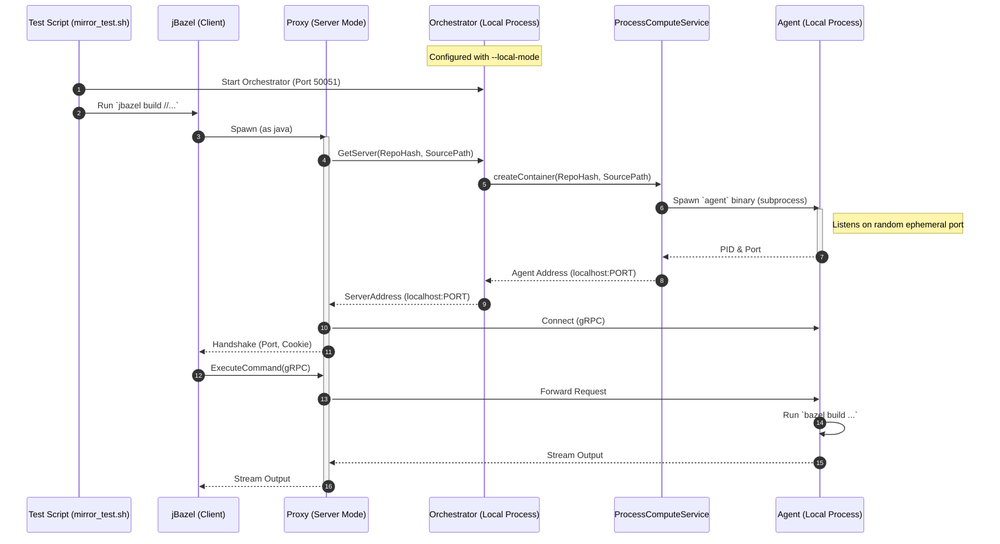
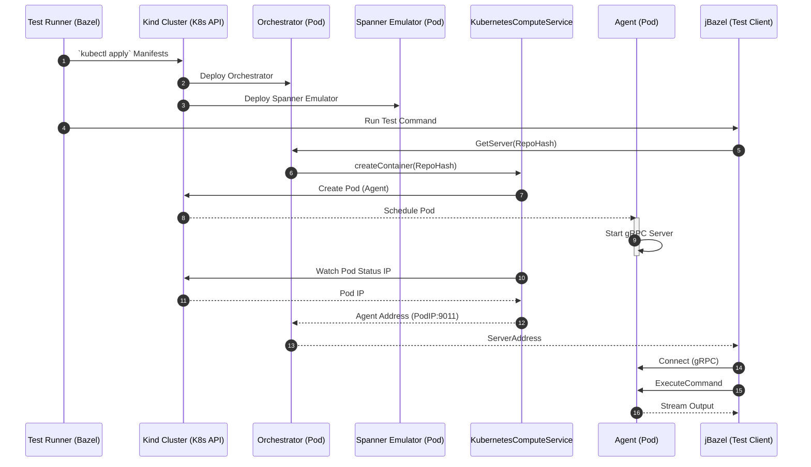

# Remote Build Server Architecture

This document outlines the architecture of the Remote Build Server (RBS) system, identifying the testing flows and the target production state.

## 1. Process-Based Integration Test (`mirror_test`)

This flow represents the local development loop (`e2e/mirror_test.sh`) where all components run as local processes on the developer's machine. This is used for fast feedback and logic verification without the overhead of containers or Kubernetes.

## 2. Kind E2E Test Flow

This flow represents the `//e2e:kind_test` (or `run_kind_e2e.sh`) workflow, which validates the system in a Kubernetes environment (Kind).

